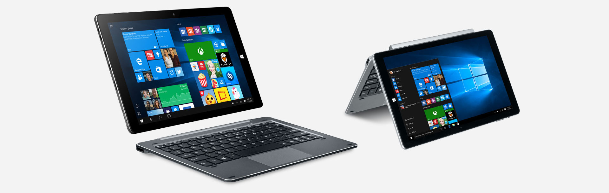

# Linux For CHUWI HiBook Pro


# => THIS REPOSITORY IS BUILD <=
Please, come back soon.

## Specifications
* Manufacturer: CHUWI
* Model: HiBook Pro


* Motherboard: Hampoo, Cherry Trail CR (I1D6_C109K)
* CPU: Intel(R) Atom(TM) x5-Z8300 CPU @ QUAD 1.44GHz
* GPU: Intel graphics, 2013 VVX10T022N00 (2560x1600px, 16:9, IPS, 10-Point Touch)
* RAM: 4 GB, ECC, DIMM DDR3 1066 MHz (0.9 ns)
* ROM: eMMC SanDisk DF4064 29217F72 (64 GB ROM) + up to 128 GB microSD
* Wi-Fi: Realtek RTL8723BS SDIO
* Bluetooth: BCM2E7B
* Audio: Realtek I2S Audio Codec, Intel SST Audio (WDM)
* cameras: OV2680 (front), OV8858 (rear)
* Sensors:
 * Capella Micro CM3218x Ambient Light Sensor
 * Bosh Accelerometer

## Software
* OS: Debian 9
* Desktop Environment: Gnome 3


# Adding Support For RTL8723BS (Wi-Fi)
Compile and install this drivers.

[Source](https://github.com/hadess/rtl8723bs/wiki/RTL8723BS-module-building-instruction-for-Debian-GNU-Linux)

# Adding Support For Audio
## BIOS configuration (NOT WORK!!!)
1. Go to BIOS
2. Select `Chipset` Tab
3. Select `South Bridge`
4. Select `LPSS & SCC Configuration`
5. Select `SCC SDIO Support` and change from `ACPI Mode` to `PCI Mode`
6. Exit with save changes

# Adding Touch Screen Support
1. Install the `xserver-xorg-input-evdev` package
2. Append following config block to /etc/X11/xorg.conf file (create the file if it is not exists before)
```
Section "InputClass"
	Identifier "evdev tablet catchall"
	MatchIsTablet "on"
	MatchDevicePath "/dev/input/event*"
	Driver "evdev"
EndSection
```
[Solution 2](https://boundarydevices.com/debian-in-more-depth-adding-touch-support/)

## Useful packages
* okular - screen reader for PDF, ebooks, with touch scrolling support
* xournal - support for stylus with draw and eraser functions
* xserver-xorg-input-wacom - Wacom tablet support for Xorg
* xserver-xorg-input-multitouch - for multi-touch input
* [Grab and Drag](https://addons.mozilla.org/en-US/firefox/addon/grab-and-drag/) - add-ons for Firefox or Iceweasel
* [touchegg](https://www.linux.com/learn/how-configure-touchscreen-linux) - gesture

## Virtual Keyboard
| Keyboard | auto hide | word completion | transparency | handwrite |
| :------- | :-------- | --------------- | :----------- | :-------- |
| [GOK](http://www.gok.ca/gok) | yes | yes | no | no |
| [Florence](http://florence.sourceforge.net/english/alternatives.html) | yes | no | yes | no |
| [Onboard](https://launchpad.net/onboard) | no | no | no | no |
| [XVKBD](http://homepage3.nifty.com/tsato/xvkbd) | no | yes | no | no |
| [Caribou](https://wiki.gnome.org/action/show/Projects/Caribou?action=show&redirect=Caribou) | ??? | ??? | ??? | no |
| [CellWriter](https://github.com/risujin/cellwriter) | ??? | ??? | ??? | yes |
